# 在线评测系统(Coding Arena)详细项目说明文档

## 项目概述

Coding Arena是一个基于微服务架构的**在线评测系统(Online Judge)**，专门用于算法竞赛、编程练习和代码评测。系统采用Spring Cloud微服务架构，支持高并发代码评测，提供完整的竞赛管理、题目管理、用户管理等功能。

### 核心特性
- **代码评测引擎**：基于Docker沙箱的安全代码执行环境
- **微服务架构**：服务拆分，独立部署，高可用性
- **高并发处理**：Redis缓存 + RabbitMQ消息队列
- **分布式架构**：Nacos服务注册与配置中心
- **容器化部署**：Docker + Docker Compose一键部署
- **权限控制**：JWT令牌 + 网关统一认证

## 技术架构

### 技术栈详情

#### 后端技术栈
- **框架**：Spring Boot 3.0.1 + Spring Cloud 2022.0.0
- **微服务**：Spring Cloud Alibaba 2022.0.0.0-RC2
- **数据库**：MyBatis-Plus 3.5.5 + MySQL 8.0
- **缓存**：Redis 7.0 + Redisson
- **消息队列**：RabbitMQ 3.11
- **搜索引擎**：Elasticsearch 8.5
- **容器化**：Docker + Docker Java 3.3.4
- **定时任务**：XXL-Job 2.4.0
- **对象存储**：阿里云OSS
- **安全**：JWT + Spring Security

#### 中间件与服务
- **服务注册/配置中心**：Nacos 2.2
- **API网关**：Spring Cloud Gateway
- **监控**：Spring Boot Actuator
- **日志**：Logback + SLF4J
- **文档**：SpringDoc OpenAPI 2.2.0

## 系统架构图

### 1.1 整体架构流程图
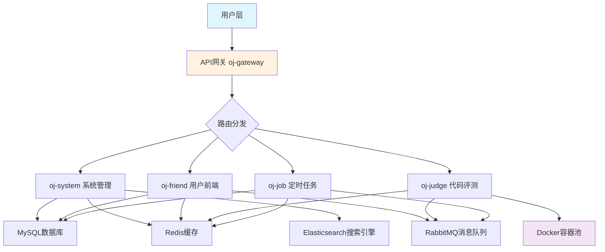

### 1.2 微服务调用关系图
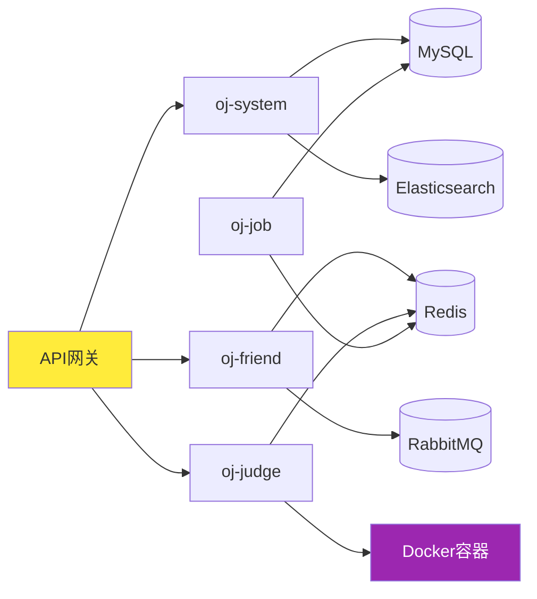

## 分模块详细设计

### 1. 网关模块 (oj-gateway)

#### 1.1 模块定位
- **统一入口**：所有外部请求的唯一入口
- **统一认证**：JWT令牌验证，权限控制
- **路由转发**：基于路径的智能路由
- **安全防护**：防止未授权访问，接口白名单机制

#### 1.2 核心设计

##### 1.2.1 认证过滤器 (AuthFilter)
```java
// 核心功能
- 白名单路径匹配（AntPathMatcher）
- JWT令牌解析与验证
- Redis令牌一致性验证
- 身份与路径权限匹配
- 统一响应格式
```

**白名单配置** (`IgnoreWhiteProperties`):
```yaml
security:
  ignore:
    whiteList:
      - "/user/semiLogin/**"
      - "/user/login"
      - "/user/code"
      - "/doc.html"
      - "/swagger-ui/**"
```

**认证流程**:
1. 请求路径白名单检查
2. 提取Authorization头中的JWT令牌
3. 验证JWT签名和有效期
4. Redis中验证令牌状态
5. 身份权限与请求路径匹配
6. 通过则转发，否则返回401

##### 1.2.2 网关认证流程图
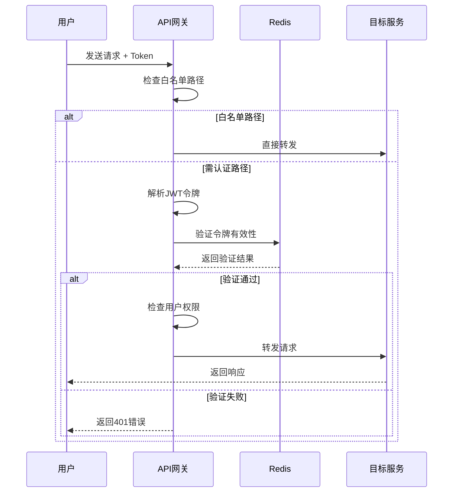

##### 1.2.3 技术亮点
- **Ordered接口**：优先级-200，确保最先执行
- **RefreshScope**：支持配置热更新
- **WebFlux响应式**：非阻塞IO，高并发支持
- **统一异常处理**：标准化的错误响应格式

### 2. 系统管理模块 (oj-system)

#### 2.1 模块定位
- **后台管理**：管理员专用后台接口
- **题库管理**：题目CRUD、分类、难度管理
- **竞赛管理**：竞赛创建、发布、题目关联
- **用户管理**：管理员用户信息维护

#### 2.2 功能模块

##### 2.2.1 题目管理
- **题目CRUD**：支持单题/批量操作
- **测试用例管理**：输入输出用例维护
- **难度分级**：1-5级难度体系
- **分类标签**：算法类型、知识点标签

**题目实体结构**:
```java
Question {
    Long questionId;        // 题目ID
    String title;          // 标题
    String content;        // 题目描述
    String inputFormat;    // 输入格式
    String outputFormat;   // 输出格式
    Integer difficulty;    // 难度等级
    Integer score;         // 分值
    String sampleInput;    // 样例输入
    String sampleOutput;   // 样例输出
    String testCases;      // 测试用例JSON
    String tags;          // 标签JSON
    Integer status;       // 状态
}
```

##### 2.2.2 竞赛管理
- **竞赛生命周期**：创建→编辑→发布→结束→统计
- **题目关联**：竞赛题目顺序、分值配置
- **时间控制**：开始时间、结束时间、持续时间
- **参与人员**：公开/指定用户参与

##### 2.2.3 管理员用户管理
- **管理员登录**：独立登录体系
- **权限控制**：管理员权限验证
- **用户状态**：正常/禁用状态管理

### 3. 用户前端模块 (oj-friend)

#### 3.1 模块定位
- **用户交互**：普通用户主要操作接口
- **答题系统**：题目练习、代码提交
- **竞赛参与**：在线竞赛、实时排名
- **个人中心**：用户信息、答题记录

#### 3.2 核心功能

##### 3.2.1 用户认证系统
- **注册登录**：邮箱验证码注册、密码登录
- **JWT令牌**：无状态认证，支持多端登录
- **用户状态**：正常/禁用状态检查
- **限流保护**：Redis分布式限流器

**用户注册流程图**:
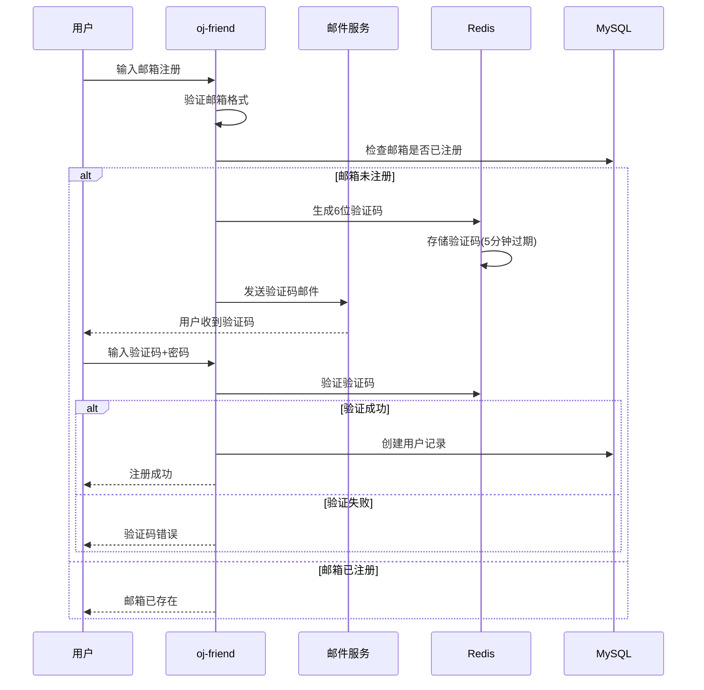

**用户登录流程图**:
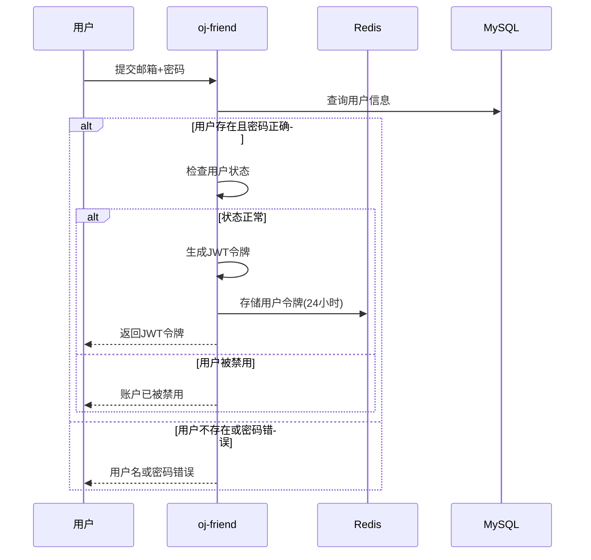

**限流实现** (`CheckRateLimiter`):
- 基于Redis的令牌桶算法
- 用户维度限流：每个用户独立计数
- 接口维度限流：不同接口不同阈值
- 滑动窗口：时间窗口内请求计数

**限流算法流程图**:
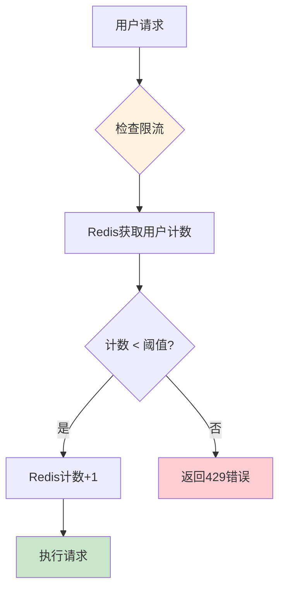

##### 3.2.2 代码提交系统
- **代码提交**：支持Java语言
- **实时评测**：同步返回评测结果
- **异步评测**：RabbitMQ消息队列处理
- **结果缓存**：Redis缓存评测结果

**代码提交流程图**:
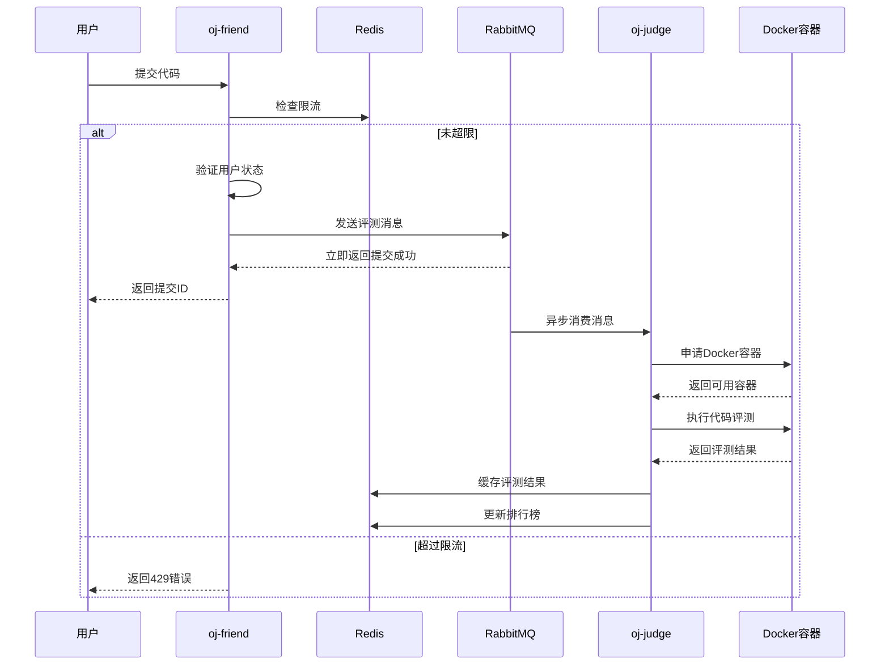

##### 3.2.3 竞赛系统
- **竞赛列表**：进行中的竞赛展示
- **竞赛详情**：题目列表、竞赛规则
- **实时排名**：基于Redis的实时排名
- **题目切换**：上一题/下一题导航

##### 3.2.4 热榜系统
- **题目热榜**：基于提交次数的热度排行
- **实时更新**：每次提交自动更新热度
- **Redis实现**：ZSet数据结构，score作为热度值

### 4. 评测模块 (oj-judge)

#### 4.1 模块定位
- **代码执行**：安全的代码执行环境
- **评测引擎**：代码正确性验证
- **资源限制**：内存、时间、CPU限制
- **结果判定**：通过/部分通过/错误分类

#### 4.2 核心技术实现

##### 4.2.1 Docker沙箱环境
- **容器化执行**：每个代码在独立容器中运行
- **资源限制**：
  - 内存限制：128MB-512MB
  - CPU限制：0.5-2核
  - 时间限制：1-10秒
  - 网络隔离：无网络连接

**容器配置** (`DockerSandBoxPoolConfig`):
```yaml
sandbox:
  docker:
    host: unix:///var/run/docker.sock
    memoryLimit: 268435456    # 256MB
    memorySwapLimit: 268435456
    cpuLimit: 1
    poolSize: 5
    imageName: openjdk:17-jdk-slim
```

##### 4.2.2 容器池管理
- **预创建容器**：系统启动时创建5个容器
- **复用机制**：容器重复使用，避免频繁创建销毁
- **阻塞队列**：ArrayBlockingQueue实现容器获取/归还
- **故障恢复**：容器异常时自动重启

**容器创建流程图**:
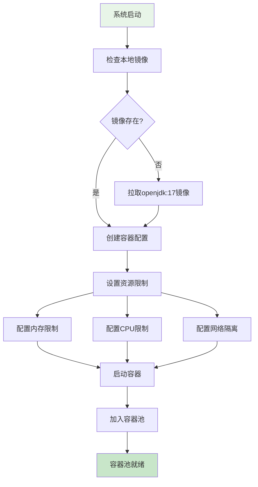

**容器获取/归还流程图**:
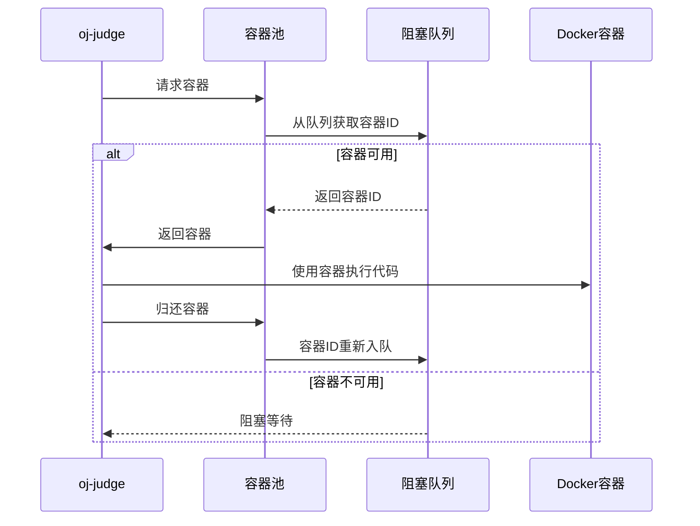

##### 4.2.3 代码评测流程

**代码评测详细流程图**:
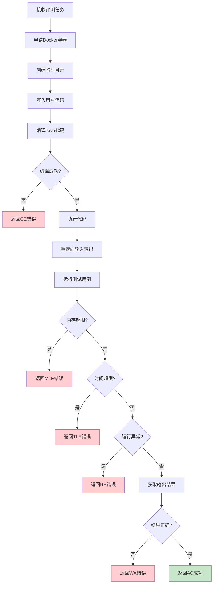

**评测结果状态机**:
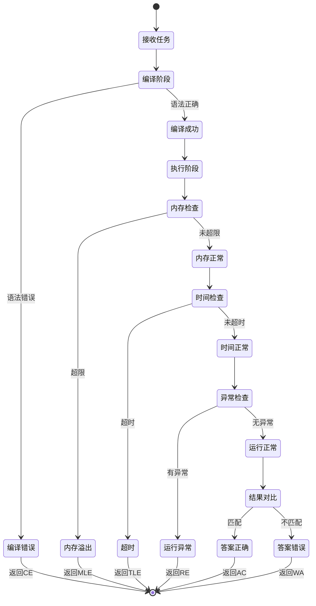

##### 4.2.4 消息队列处理
- **RabbitMQ集成**：解耦提交与评测
- **工作队列模式**：多个消费者并行处理
- **消息持久化**：防止消息丢失
- **失败重试**：异常时自动重试

**RabbitMQ消息流程图**:
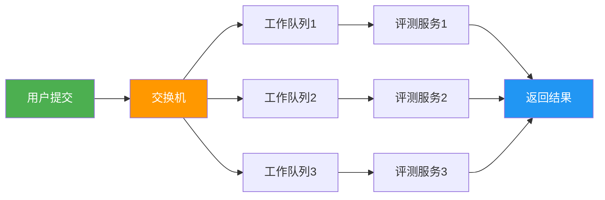

### 5. 任务模块 (oj-job)

#### 5.1 模块定位
- **定时任务**：系统级定时任务执行
- **竞赛统计**：结束后自动统计成绩
- **消息推送**：竞赛结果自动通知
- **缓存刷新**：定期更新Redis缓存

#### 5.2 核心任务

##### 5.2.1 竞赛结果统计
- **触发时机**：竞赛结束后1小时内
- **统计内容**：
  - 用户总分计算
  - 竞赛排名生成
  - 个人成绩通知
- **消息推送**：系统消息推送给参与用户

**竞赛统计定时任务流程图**:
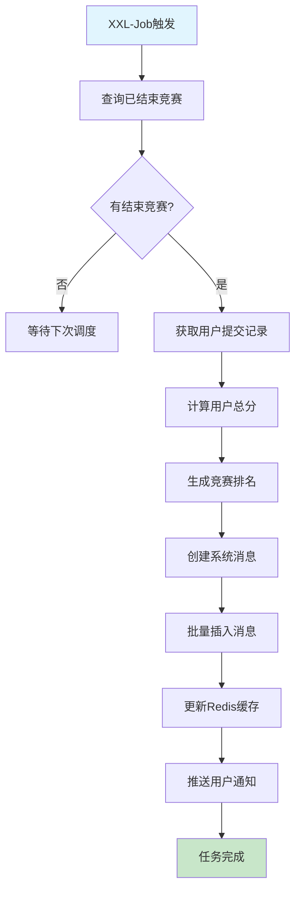

**消息推送详细流程图**:
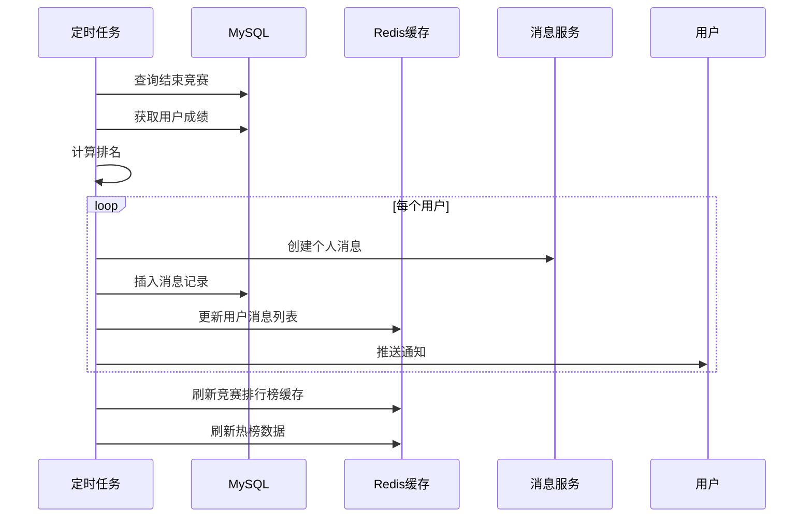

##### 5.2.2 缓存刷新任务
- **未完成竞赛缓存**：每30分钟刷新
- **历史竞赛缓存**：每60分钟刷新
- **热榜数据**：实时更新
- **排行榜缓存**：竞赛结束后刷新

##### 5.2.3 XXL-Job集成
- **分布式调度**：支持集群部署
- **任务监控**：执行日志、成功失败统计
- **失败重试**：自动重试机制
- **动态配置**：运行时调整任务参数

### 6. 公共组件 (oj-common)

#### 6.1 模块化设计
- **oj-common-core**：核心业务组件
- **oj-common-redis**：Redis操作封装
- **oj-common-security**：安全认证组件
- **oj-common-rabbitmq**：消息队列组件
- **oj-common-elasticsearch**：搜索引擎组件
- **oj-common-file**：文件存储组件
- **oj-common-message**：消息服务组件
- **oj-common-swagger**：API文档组件

#### 6.2 核心组件详解

##### 6.2.1 核心模块 (oj-common-core)

**BaseEntity**：所有实体基类
```java
- 创建人/时间自动填充
- 更新人/时间自动维护
- 序列化支持
```

**统一响应封装** (`Result`):
```java
Result<T> {
    Integer code;    // 状态码
    String message;  // 消息
    T data;         // 数据
    Long timestamp; // 时间戳
}
```

**状态码规范** (`ResultCode`):
- 1000：操作成功
- 2000：服务繁忙
- 300x：权限相关
- 310x：业务错误

**JWT工具类** (`JWTUtils`):
- 令牌生成与解析
- 支持HS512算法
- 载荷自定义扩展

##### 6.2.2 Redis组件 (oj-common-redis)

**RedisService**：统一Redis操作API
- **String操作**：缓存对象、设置过期时间
- **List操作**：分页查询、范围获取
- **Hash操作**：对象存储、批量操作
- **ZSet操作**：排行榜、热榜实现
- **原子操作**：自增、批量操作

**缓存设计模式**:
- **Key命名规范**：`业务:模块:操作:ID`
- **过期策略**：业务数据1小时，配置数据24小时
- **缓存穿透**：布隆过滤器防护
- **缓存雪崩**：随机过期时间
- **缓存击穿**：分布式锁保护

**典型缓存结构**:
```
# 用户令牌
user:token:{userId} -> LoginUser对象

# 题目详情
question:detail:{questionId} -> Question对象

# 竞赛列表
exam:list:{type} -> [examId1, examId2, ...]

# 竞赛排名
exam:rank:{examId} -> [UserScore对象列表]

# 热榜
hot:question:list -> ZSet<questionId, score>
```

**Redis缓存架构图**:
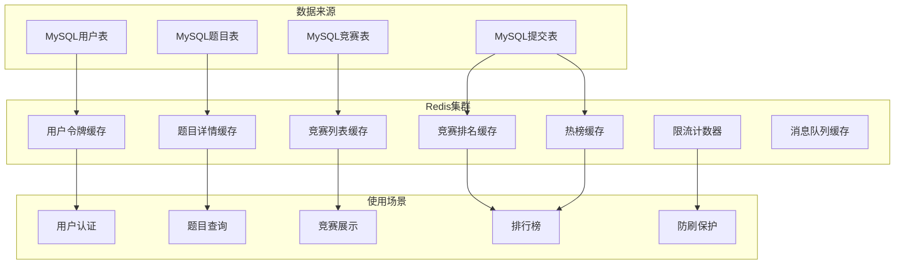

##### 6.2.3 安全组件 (oj-common-security)

**TokenInterceptor**：微服务级令牌验证
- **双重验证**：网关+服务双重验证
- **ThreadLocal**：用户ID线程传递
- **令牌续签**：活跃用户自动延长有效期
- **资源清理**：请求完成后自动清理

**WebMvcConfig**：统一MVC配置
```java
- TokenInterceptor注册
- 跨域处理(CORS)
- 静态资源映射
- 参数解析器配置
```

##### 6.2.4 消息队列组件 (oj-common-rabbitmq)

**RabbitConfig**：统一RabbitMQ配置
- **连接工厂**：连接池配置
- **序列化**：JSON消息序列化
- **重试机制**：消息重试策略
- **死信队列**：失败消息处理

**典型消息场景**:
- **代码评测**：异步处理用户提交
- **缓存刷新**：批量更新Redis缓存
- **消息通知**：竞赛结果推送
- **日志收集**：异步日志处理

## 数据库设计

### 数据库关系图
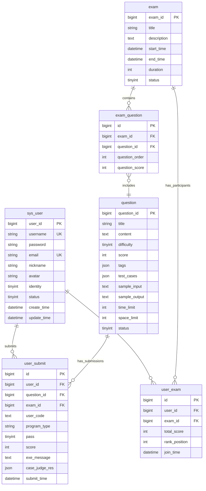

### 核心表结构

#### 用户表 (sys_user)
```sql
CREATE TABLE sys_user (
    user_id BIGINT PRIMARY KEY AUTO_INCREMENT,
    username VARCHAR(50) UNIQUE NOT NULL,
    password VARCHAR(255) NOT NULL,
    email VARCHAR(100) UNIQUE,
    nickname VARCHAR(50),
    avatar VARCHAR(255),
    identity TINYINT DEFAULT 1 COMMENT '1用户 2管理员',
    status TINYINT DEFAULT 1 COMMENT '1正常 2禁用',
    create_time DATETIME DEFAULT CURRENT_TIMESTAMP,
    update_time DATETIME DEFAULT CURRENT_TIMESTAMP ON UPDATE CURRENT_TIMESTAMP
);
```

#### 题目表 (question)
```sql
CREATE TABLE question (
    question_id BIGINT PRIMARY KEY AUTO_INCREMENT,
    title VARCHAR(200) NOT NULL,
    content TEXT,
    difficulty TINYINT DEFAULT 1,
    score INT DEFAULT 100,
    tags JSON,
    test_cases JSON,
    sample_input TEXT,
    sample_output TEXT,
    time_limit INT DEFAULT 1000 COMMENT 'ms',
    space_limit INT DEFAULT 128 COMMENT 'MB',
    status TINYINT DEFAULT 1,
    create_time DATETIME DEFAULT CURRENT_TIMESTAMP
);
```

#### 竞赛表 (exam)
```sql
CREATE TABLE exam (
    exam_id BIGINT PRIMARY KEY AUTO_INCREMENT,
    title VARCHAR(200) NOT NULL,
    description TEXT,
    start_time DATETIME,
    end_time DATETIME,
    duration INT COMMENT '分钟',
    status TINYINT DEFAULT 1 COMMENT '1未发布 2已发布 3已结束',
    create_time DATETIME DEFAULT CURRENT_TIMESTAMP
);
```

#### 用户提交表 (user_submit)
```sql
CREATE TABLE user_submit (
    id BIGINT PRIMARY KEY AUTO_INCREMENT,
    user_id BIGINT NOT NULL,
    question_id BIGINT NOT NULL,
    exam_id BIGINT,
    user_code TEXT,
    program_type VARCHAR(20) DEFAULT 'java',
    pass TINYINT DEFAULT 0 COMMENT '0未通过 1通过',
    score INT DEFAULT 0,
    exe_message TEXT,
    case_judge_res JSON,
    submit_time DATETIME DEFAULT CURRENT_TIMESTAMP,
    INDEX idx_user_question (user_id, question_id),
    INDEX idx_exam (exam_id)
);
```

## 性能优化策略

### 1. 缓存优化
- **多级缓存**：Redis + 本地缓存
- **缓存预热**：系统启动时加载热点数据
- **缓存更新**：消息队列异步更新
- **缓存穿透**：布隆过滤器防护

### 2. 数据库优化
- **读写分离**：主从复制架构
- **分库分表**：按业务模块分库
- **索引优化**：高频查询字段建索引
- **连接池**：HikariCP连接池优化

### 3. 代码评测优化
- **容器池**：预创建容器，避免频繁创建销毁
- **批量处理**：消息队列批量处理提交
- **资源限制**：严格控制内存和CPU使用
- **并发控制**：限流保护系统资源

### 4. 前端优化
- **CDN加速**：静态资源CDN分发
- **接口缓存**：浏览器缓存策略
- **分页加载**：大数据分页展示
- **懒加载**：图片和组件懒加载

## 安全设计

### 1. 认证授权
- **JWT令牌**：无状态认证，支持多端登录
- **权限分级**：系统管理员/用户二级权限
- **接口鉴权**：网关统一权限验证
- **令牌续签**：活跃用户自动延长有效期

### 2. 代码安全
- **沙箱执行**：Docker容器隔离执行环境
- **资源限制**：内存、CPU、网络严格限制
- **输入验证**：代码和参数严格验证
- **输出过滤**：防止XSS和注入攻击

### 3. 数据安全
- **密码加密**：BCrypt密码加密存储
- **敏感信息脱敏**：日志中敏感信息脱敏
- **HTTPS传输**：全站HTTPS加密传输
- **SQL注入防护**：MyBatis参数化查询

## 部署架构

### 1. 容器化部署
```yaml
# docker-compose.yml核心配置
version: '3.8'
services:
  # 网关服务
  oj-gateway:
    image: oj-gateway:latest
    ports:
      - "8080:8080"
    environment:
      - SPRING_PROFILES_ACTIVE=prod
      - NACOS_SERVER=nacos:8848
  
  # 业务服务
  oj-system:
    image: oj-system:latest
    environment:
      - SPRING_PROFILES_ACTIVE=prod
      - MYSQL_HOST=mysql
      - REDIS_HOST=redis
  
  # 基础设施
  mysql:
    image: mysql:8.0
    environment:
      - MYSQL_ROOT_PASSWORD=root123
      - MYSQL_DATABASE=coding_arena
  
  redis:
    image: redis:7.0-alpine
  
  rabbitmq:
    image: rabbitmq:3.11-management
```

### 2. 环境配置
- **开发环境**：本地Docker Compose一键启动
- **测试环境**：独立测试数据库和中间件
- **生产环境**：Kubernetes集群部署

### 3. 监控告警
- **服务监控**：Spring Boot Actuator
- **日志收集**：ELK日志收集分析
- **性能监控**：应用性能指标监控
- **异常告警**：钉钉/邮件自动告警

## 扩展性设计

### 1. 水平扩展
- **无状态服务**：所有服务无状态设计
- **负载均衡**：Nginx/SLB负载均衡
- **服务发现**：Nacos自动服务注册发现
- **弹性伸缩**：基于CPU/内存自动扩缩容

### 2. 功能扩展
- **多语言支持**：Java/Python/C++评测引擎
- **新题型支持**：填空题、选择题扩展
- **AI评测**：智能代码质量评估
- **社交功能**：讨论区、题解分享

### 3. 性能扩展
- **分片存储**：Elasticsearch集群分片
- **读写分离**：MySQL主从读写分离
- **缓存集群**：Redis Cluster集群部署
- **消息集群**：RabbitMQ集群部署

## 测试策略

### 1. 单元测试
- **Service层测试**：Mock数据库和外部依赖
- **Controller层测试**：MockMvc接口测试
- **工具类测试**：工具方法边界测试

### 2. 集成测试
- **API接口测试**：Postman/Newman自动化测试
- **数据库测试**：数据一致性验证
- **消息队列测试**：消息生产和消费测试

### 3. 性能测试
- **并发测试**：JMeter高并发压测
- **负载测试**：系统最大承载能力
- **稳定性测试**：长时间运行稳定性

## 项目亮点总结

### 1. 架构亮点
- **微服务拆分**：职责清晰，独立部署
- **容器化执行**：安全隔离的代码运行环境
- **高并发处理**：Redis + MQ的异步处理架构
- **弹性扩展**：无状态服务，支持水平扩展

### 2. 技术亮点
- **Docker容器池**：预创建容器，资源复用
- **JWT无状态认证**：支持分布式部署
- **Redis多级缓存**：提升系统响应速度
- **消息队列解耦**：异步处理，削峰填谷

### 3. 业务亮点
- **竞赛系统**：完整的竞赛生命周期管理
- **实时排名**：基于Redis的实时排行榜
- **热榜算法**：基于用户行为的智能推荐
- **代码评测**：多维度代码质量评估

### 4. 运维亮点
- **配置中心**：Nacos集中配置管理
- **监控告警**：全方位系统监控
- **日志追踪**：ELK日志分析平台
- **一键部署**：Docker Compose快速部署

## 未来规划

### 1. 功能增强
- **多语言评测**：支持Python、C++、Go等语言
- **AI辅助**：智能代码提示、错误诊断
- **社交功能**：题解分享、讨论社区
- **移动端**：微信小程序/APP支持

### 2. 性能优化
- **全球加速**：CDN全球节点部署
- **边缘计算**：代码评测边缘节点
- **智能调度**：基于负载的智能评测调度
- **缓存优化**：多级缓存架构优化

### 3. 架构升级
- **Service Mesh**：Istio服务网格
- **Serverless**：函数计算评测引擎
- **云原生**：Kubernetes原生部署
- **多云支持**：阿里云/腾讯云/华为云适配

---

**文档版本**：V1.0  
**最后更新**：2024年8月  
**维护团队**：Coding Arena开发组