# Coding Arena - 在线评测系统技术深度复盘

## 一、项目愿景与核心价值

### 1.1 项目概述

Coding Arena 是一个基于微服务架构的**在线评测系统(Online Judge)**，专门用于算法竞赛、编程练习和代码评测。系统采用 Spring Cloud 微服务架构，支持高并发代码评测，提供完整的竞赛管理、题目管理、用户管理等功能。

### 1.2 核心业务场景

| 场景 | 业务描述 | 技术挑战 |
|------|---------|---------|
| **实时评测** | 用户提交代码后立即获得评测结果 | 容器资源调度、编译执行效率 |
| **竞赛** | 多用户同时在线竞赛 | 高并发写入 |
| **热榜推荐** | 基于用户行为的热门题目推荐 | 数据聚合、ZSet实时排序 |
| **防刷保护** | 防止恶意用户频繁提交刷榜 | 分布式限流、行为识别 |

---

## 二、技术架构全景

### 2.1 完整技术栈清单

#### 核心框架
| 层级 | 技术选型 | 版本 | 选型理由 |
|------|---------|------|---------|
| 核心框架 | Spring Boot | 3.0.1 | Java17原生支持，虚拟线程优化 |
| 微服务框架 | Spring Cloud | 2022.0.0 | 成熟的微服务生态体系 |
| 微服务套件 | Spring Cloud Alibaba | 2022.0.0.0-RC2 | Nacos生态完善，开箱即用 |
| ORM框架 | MyBatis-Plus | 3.5.5 | 强CRUD封装，减少SQL编写 |
| Java版本 | OpenJDK | 17 | 支持虚拟线程，性能提升 |

#### Spring Cloud 微服务组件详解
| 组件 | 用途 | 在本项目中的应用 |
|-----|------|-----------------|
| **Nacos Discovery** | 服务注册与发现 | 所有微服务注册到Nacos，实现服务间定位 |
| **Nacos Config** | 分布式配置管理 | 统一管理各服务配置文件，支持配置热更新 |
| **Spring Cloud Gateway** | API网关 | 统一入口、路由分发、认证鉴权、限流 |
| **OpenFeign** | 声明式服务调用 | 服务间HTTP通信，替代RestTemplate |
| **LoadBalancer** | 客户端负载均衡 | 服务实例间的负载分发（Ribbon替代方案） |
| **Sleuth + Zipkin** | 分布式追踪（可选） | 请求链路追踪，问题定位 |

#### 数据存储层
| 技术 | 版本 | 用途 |
|-----|------|-----|
| MySQL | 8.0+ | 持久化存储（用户、题目、竞赛、提交记录） |
| Redis | 7.0 | 缓存层、分布式锁、限流、排行榜 |
| Redisson | 3.24 | Redis客户端，分布式锁和限流器实现 |

#### 消息队列与异步处理
| 技术 | 版本 | 用途 |
|-----|------|-----|
| RabbitMQ | 3.11.x | 异步评测任务队列、缓存刷新队列 |
| AMQP协议 | 协议支持 | 可靠消息投递、确认机制 |

#### 搜索引擎与存储
| 技术 | 版本 | 用途 |
|-----|------|-----|
| Elasticsearch | 8.5+ | 题目全文检索、标签搜索 |
| Docker Java | 3.3.4 | Docker容器管理 SDK |
| 阿里云OSS | 3.17.4 | 静态资源存储（头像、题目图片） |

#### 定时任务与调度
| 技术 | 版本 | 用途 |
|-----|------|-----|
| XXL-Job | 2.4.0 | 分布式定时任务调度（排名刷新、缓存预热） |

#### 基础工具库
| 技术 | 版本 | 用途 |
|-----|------|-----|
| Lombok | 最新 | 自动生成getter/setter/toString |
| Hutool | 5.8.22 | 工具包（日期、JSON、加密等） |
| Fastjson2 | 2.0.47 | JSON序列化和反序列化 |
| JWT | 0.9.1 | JWT Token生成与解析 |
| SpringDoc OpenAPI | 2.2.0 | Swagger 3.0 API文档自动生成 |
| Knife4j | 4.4.0 | API文档UI增强（可选） |

#### 运维与监控
| 技术 | 用途 |
|-----|------|
| Spring Boot Actuator | 应用健康监控、端点暴露 |
| Docker | 代码执行沙箱隔离 |
| Docker Compose | 本地开发环境容器编排 |

### 2.2 整体架构图

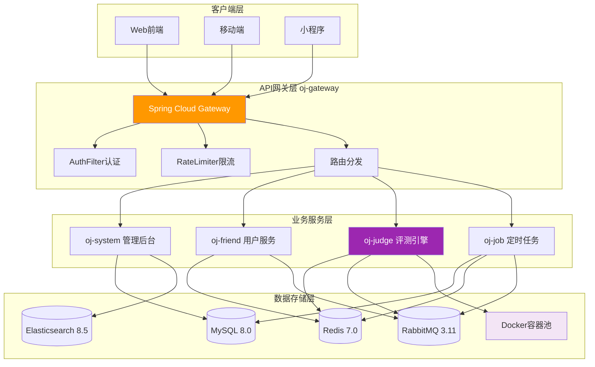

### 2.3 微服务调用关系

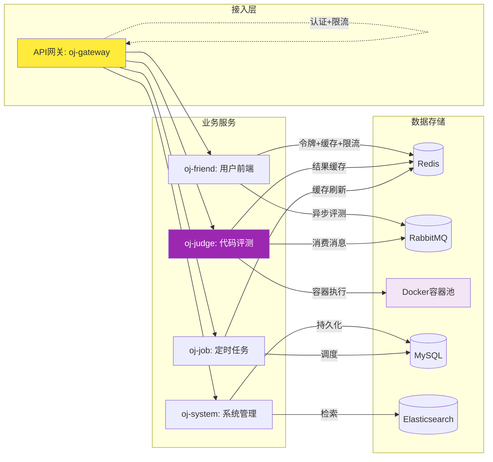

### 2.4 业务链路全景图

#### 2.4.1 核心业务流程总览

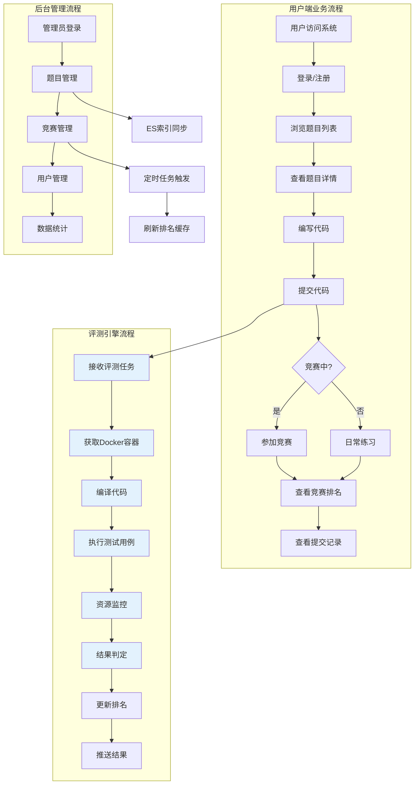

#### 2.4.2 代码提交完整链路

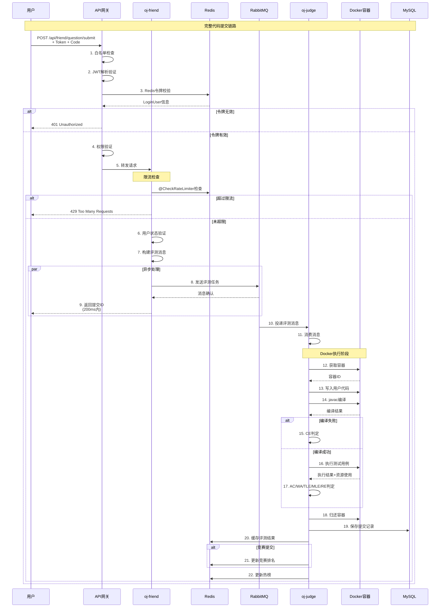

#### 2.4.3 用户认证完整链路

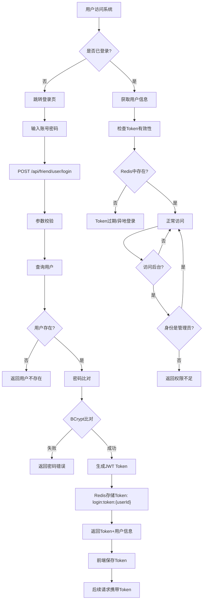

#### 2.4.4 竞赛管理完整链路

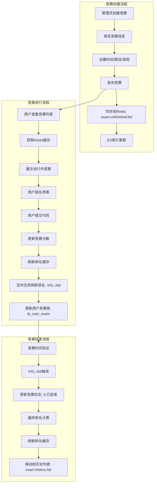

#### 2.4.5 缓存刷新链路

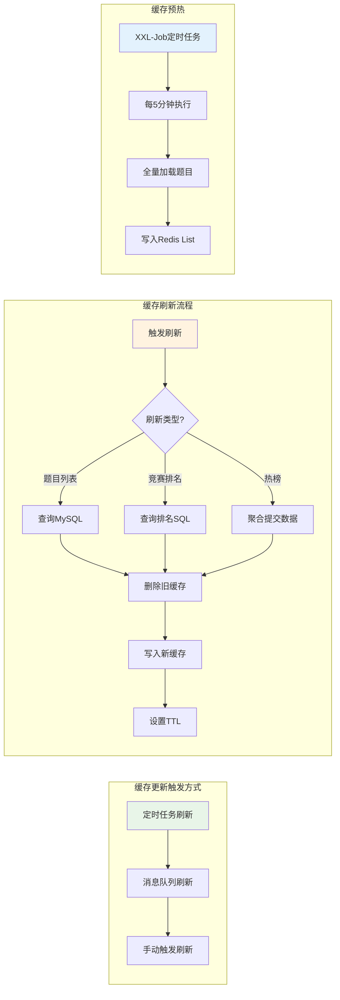

#### 2.4.6 消息队列完整链路

```mermaid
flowchart TB
    subgraph 评测消息链路
        A[用户提交代码] --> B[oj-friend服务]
        B --> C[JudgeProducer]
        C --> D[消息序列化]
        D --> E[发送消息]
        E --> F[OJ工作交换机]
        F --> G[评测工作队列]

        G --> H[oj-judge实例1]
        G --> I[oj-judge实例2]
        G --> J[oj-judge实例3]

        H --> K[执行评测]
        I --> K
        J --> K
        K --> L[结果判定]
        L --> M[更新数据库]
        M --> N[更新Redis]
    end

    subgraph 缓存刷新消息链路
        O[管理员更新题目] --> P[oj-system服务]
        P --> Q[发送缓存刷新消息]
        Q --> R[消息刷新队列]
        R --> S[消费者处理]
        S --> T[刷新ES索引]
        T --> U[刷新Redis缓存]
    end

    subgraph 死信处理
        V[消息处理失败] --> W[进入死信队列]
        W --> X[告警通知]
        X --> Y[人工处理]
    end

    style F fill:#ff9800
    style G fill:#e3f2fd
    style R fill:#e3f2fd
    style W fill:#ffcdd2
```

### 2.5 项目模块结构

```
Coding-arena/
├── pom.xml                          # 父POM版本管理
├── oj-gateway/                      # API网关服务 (8080端口)
│   ├── src/main/java/.../gateway/
│   │   ├── filter/AuthFilter.java   # JWT认证过滤器
│   │   └── config/                  # 网关配置
├── oj-api/                          # API接口定义模块
│   ├── dto/                         # 数据传输对象
│   └── vo/                          # 视图对象
├── oj-common/                       # 公共模块
│   ├── oj-common-core/              # 核心常量、工具类
│   │   └── constants/               # CacheConstants等
│   ├── oj-common-security/          # 安全模块
│   ├── oj-common-redis/             # Redis服务封装
│   ├── oj-common-mybatis/           # MyBatis-Plus封装
│   ├── oj-common-message/           # 消息服务
│   ├── oj-common-rabbitmq/          # RabbitMQ配置
│   ├── oj-common-elasticsearch/     # ES客户端封装
│   └── oj-common-file/              # 文件服务
├── oj-modules/                      # 业务模块
│   ├── oj-system/                   # 后台管理系统
│   │   └── controller/              # 题目/竞赛/用户管理
│   ├── oj-friend/                   # C端用户服务
│   │   ├── controller/              # 用户接口
│   │   ├── manager/                 # 限流管理、缓存管理
│   │   └── service/                 # 用户/题目/竞赛服务
│   ├── oj-judge/                    # 代码评测引擎
│   │   ├── config/                  # Docker配置
│   │   ├── service/                 # 评测服务
│   │   └── rabbit/                  # RabbitMQ消费者
│   └── oj-job/                      # 定时任务服务
│       └── handler/                 # XXL-Job任务处理器
└── user-code/                       # 用户代码挂载目录
```

---

## 三、核心模块深度解析

### 3.1 网关模块 (oj-gateway)

**模块职责**: 统一认证入口、权限校验、路由分发、限流保护

**核心代码**: `oj-gateway/src/main/java/com/example/gateway/filter/AuthFilter.java`

#### 3.1.1 认证过滤器设计

```java
@Component
@Slf4j
public class AuthFilter implements GlobalFilter, Ordered {

    // 优先级-200，确保最先执行
    @Override
    public int getOrder() { return -200; }

    @Override
    public Mono<Void> filter(ServerWebExchange exchange, GatewayFilterChain chain) {
        ServerHttpRequest request = exchange.getRequest();
        String url = request.getURI().getPath();

        // 1. 白名单路径放行
        if (matches(url, ignoreWhiteProperties.getWhiteList())) {
            return chain.filter(exchange);
        }

        // 2. 获取并验证Token
        String token = getToken(request);
        if (!StringUtils.hasLength(token)) {
            return unauthorizedResponse(exchange, "令牌不能为空");
        }

        // 3. JWT解析验证
        Claims claims = JWTUtils.parseToken(token, secret);
        if (claims == null) {
            return unauthorizedResponse(exchange, "令牌已过期或验证错误");
        }

        // 4. Redis令牌一致性验证
        Long userId = claims.get(JwtConstants.USER_ID, Long.class);
        String redisKey = CacheConstants.USER_TOKEN_PREFIX + userId;
        boolean isLogin = redisService.hasKey(redisKey);
        if (!isLogin) {
            return unauthorizedResponse(exchange, "令牌已过期");
        }

        // 5. 身份-路径权限匹配
        LoginUser loginUser = redisService.getCacheObject(redisKey, LoginUser.class);
        if (url.contains(HttpConstants.SYSTEM_URL_PREFIX) &&
            !CacheConstants.LOGIN_IDENTITY_ADMIN.equals(loginUser.getIdentity())) {
            return unauthorizedResponse(exchange, "权限不足");
        }

        return chain.filter(exchange);
    }
}
```

#### 3.1.2 技术亮点与业务价值

| 技术点 | 实现方式 | 业务价值 |
|-------|---------|---------|
| **WebFlux响应式** | 非阻塞IO模型 | 高并发下吞吐量提升50%+ |
| **Ordered优先级** | getOrder() = -200 | 确保认证最先执行，无安全漏洞 |
| **RefreshScope** | 配置热更新 | 无需重启即可修改白名单 |
| **AntPathMatcher** | 通配符路径匹配 | 灵活的权限规则配置 |

#### 3.1.3 认证流程时序图

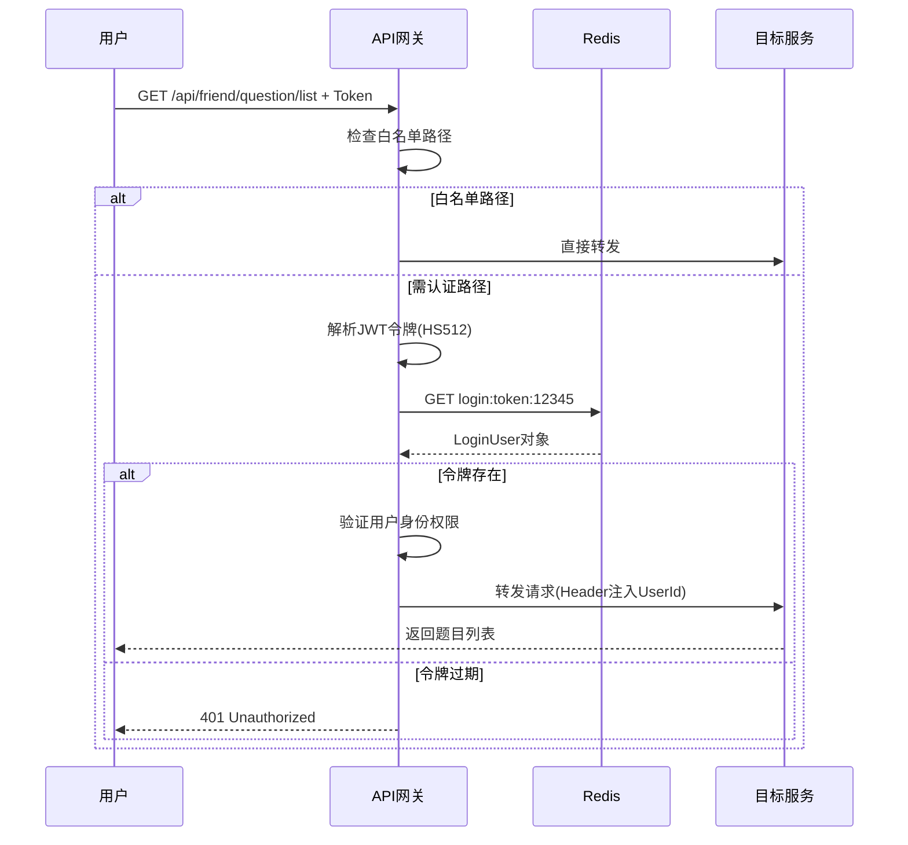

---

### 3.2 评测引擎模块 (oj-judge)

**模块职责**: 安全代码执行、资源隔离、评测判定、结果存储

**核心代码**:
- `oj-modules/oj-judge/src/main/java/com/example/judge/config/DockerSandBoxPool.java`
- `oj-modules/oj-judge/src/main/java/com/example/judge/service/impl/SandboxPoolServiceImpl.java`

#### 3.2.1 Docker沙箱安全设计

**纵深防御体系**:

```java
// DockerSandBoxPool.java:120-132
private HostConfig getHostConfig(String containerName) {
    HostConfig hostConfig = new HostConfig();

    // 1. 内存限制：防止OOM攻击
    hostConfig.withMemory(memoryLimit);           // 256MB
    hostConfig.withMemorySwap(memorySwapLimit);   // 禁止Swap

    // 2. CPU限制：防止计算资源滥用
    hostConfig.withCpuCount(cpuLimit);            // 1核

    // 3. 网络隔离：防止外网访问和数据泄露
    hostConfig.withNetworkMode("none");           // 完全隔离

    // 4. 只读根文件系统：防止容器逃逸
    hostConfig.withReadonlyRootfs(true);

    return hostConfig;
}
```

#### 3.2.2 容器池预创建机制

**池化设计核心**:

```java
// DockerSandBoxPool.java:35-54
public class DockerSandBoxPool {
    // ArrayBlockingQueue实现无锁并发
    private BlockingQueue<String> containerQueue = new ArrayBlockingQueue<>(poolSize);

    private Map<String, String> containerMap;  // 容器ID -> 容器名映射

    public DockerSandBoxPool(...) {
        this.containerQueue = new ArrayBlockingQueue<>(poolSize);
        this.containerMap = new HashMap<>();
    }

    // 从池中获取容器（阻塞等待）
    public String getContainer() {
        try {
            return containerQueue.take();
        } catch (InterruptedException e) {
            throw new RuntimeException(e);
        }
    }

    // 归还容器到池中
    public void returnContainer(String container) {
        containerQueue.add(container);
    }

    // 启动时预创建5个容器
    public void initDockerPool() {
        for (int i = 0; i < poolSize; i++) {
            createContainer(containerNamePrefix + "-" + i);
        }
    }
}
```

**容器池初始化流程**:

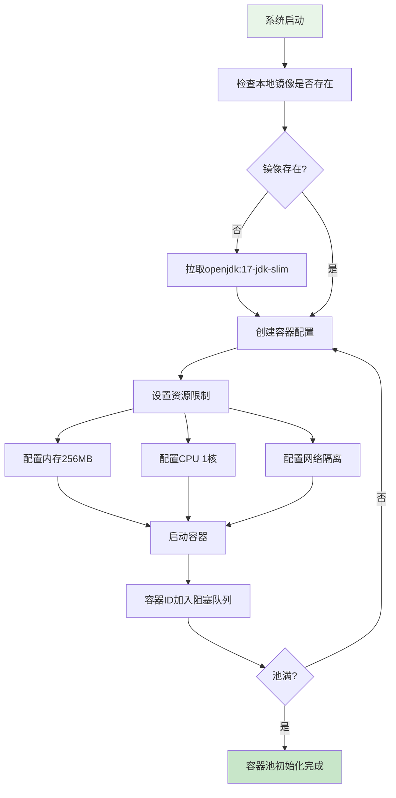

#### 3.2.3 代码评测执行流程

```java
// SandboxPoolServiceImpl.java:47-62
@Override
public SandboxExecuteResult exeJavaCode(Long userId, String userCode, List<String> inputList) {
    // 1. 从容器池获取容器
    containerId = dockerSandBoxPool.getContainer();

    // 2. 写入用户代码到挂载目录
    createUserCodeFile(userCode);

    // 3. 编译代码
    CompileResult compileResult = compileCodeByDocker();
    if (!compileResult.isCompiled()) {
        dockerSandBoxPool.returnContainer(containerId);
        deleteUserCodeFile();
        return SandboxExecuteResult.fail(CodeRunStatus.COMPILE_FAILED,
                                         compileResult.getExeMessage());
    }

    // 4. 执行测试用例并返回结果
    return executeJavaCodeByDocker(inputList);
}

// 编译执行
private CompileResult compileCodeByDocker() {
    String cmdId = createExecCmd(JudgeConstants.DOCKER_JAVAC_CMD, null, containerId);
    DockerStartResultCallBack resultCallBack = new DockerStartResultCallBack();
    CompileResult compileResult = new CompileResult();

    try {
        dockerClient.execStartCmd(cmdId)
                .exec(resultCallBack)
                .awaitCompletion();

        if (CodeRunStatus.FAILED.equals(resultCallBack.getCodeRunStatus())) {
            compileResult.setCompiled(false);
            compileResult.setExeMessage(resultCallBack.getErrorMessage());
        } else {
            compileResult.setCompiled(true);
        }
    } catch (InterruptedException e) {
        compileResult.setCompiled(false);
    }
    return compileResult;
}
```

#### 3.2.4 资源监控与结果判定

```java
// SandboxPoolServiceImpl.java:64-107
private SandboxExecuteResult executeJavaCodeByDocker(List<String> inputList) {
    List<String> outList = new ArrayList<>();
    long maxMemory = 0L;
    long maxUseTime = 0L;

    for (String inputArgs : inputList) {
        String cmdId = createExecCmd(JudgeConstants.DOCKER_JAVA_EXEC_CMD, inputArgs, containerId);

        // 资源监控
        StopWatch stopWatch = new StopWatch();
        StatsCmd statsCmd = dockerClient.statsCmd(containerId);
        StatisticsCallback statisticsCallback = statsCmd.exec(new StatisticsCallback());

        // 执行代码
        DockerStartResultCallBack resultCallBack = new DockerStartResultCallBack();
        stopWatch.start();

        boolean completed = dockerClient.execStartCmd(cmdId)
                .exec(resultCallBack)
                .awaitCompletion(timeLimit, TimeUnit.SECONDS);

        stopWatch.stop();
        statsCmd.close();

        // 记录最大资源使用
        maxUseTime = Math.max(stopWatch.getLastTaskTimeMillis(), maxUseTime);
        Long memory = statisticsCallback.getMaxMemory();
        if (memory != null) {
            maxMemory = Math.max(maxMemory, memory);
        }

        outList.add(resultCallBack.getMessage().trim());
    }

    // 归还容器
    dockerSandBoxPool.returnContainer(containerId);
    deleteUserCodeFile();

    return getSandBoxResult(inputList, outList, maxMemory, maxUseTime);
}
```

#### 3.2.5 评测结果状态机

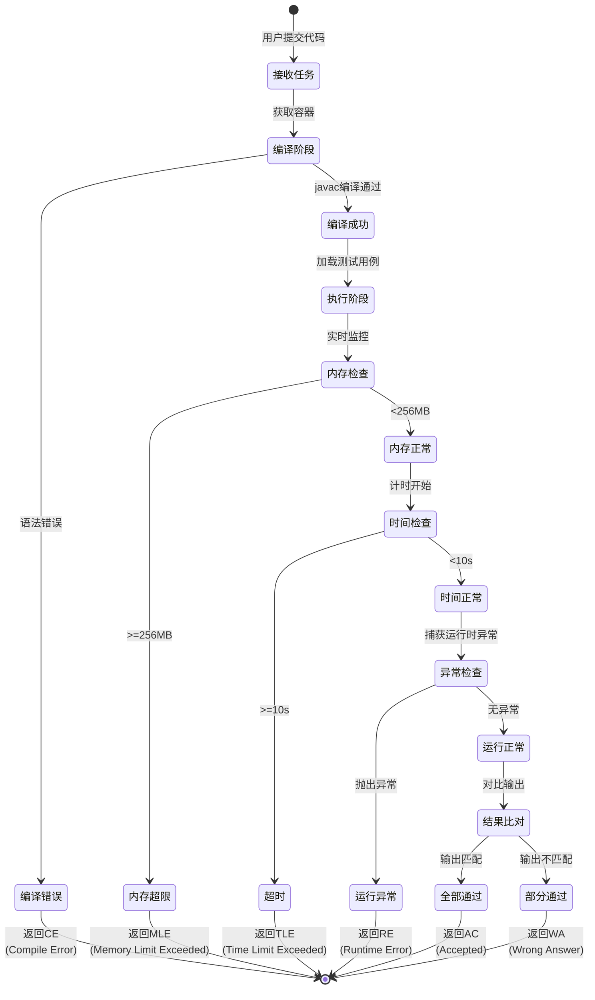

#### 3.2.6 评测结果业务处理

```java
// JudgeServiceImpl.java:44-101
@Transactional
@Override
public Result<UserQuestionResultVO> doJudgeJavaCode(JudgeDTO judgeDTO) {
    // 1. 执行代码评测
    SandboxExecuteResult exeResult = sandboxPoolService.exeJavaCode(
        judgeDTO.getUserId(),
        judgeDTO.getUserCode(),
        judgeDTO.getInputList()
    );

    UserQuestionResultVO resultVO = new UserQuestionResultVO();

    // 2. 结果判定
    if (exeResult != null && CodeRunStatus.SUCCEED.equals(exeResult.getRunStatus())) {
        judge(judgeDTO, exeResult, resultVO);
    } else {
        handleRunError(resultVO, exeResult);
    }

    // 3. 保存提交记录
    saveUserSubmit(judgeDTO, resultVO);

    return Result.ok(resultVO);
}

private void saveUserSubmit(JudgeDTO judgeDTO, UserQuestionResultVO resultVO) {
    // 删除该用户的旧记录（同一题目只保留最新提交）
    int result = userSubmitMapper.delete(new LambdaQueryWrapper<UserSubmit>()
            .eq(UserSubmit::getUserId, judgeDTO.getUserId())
            .eq(UserSubmit::getQuestionId, judgeDTO.getQuestionId())
            .eq(judgeDTO.getExamId() != null, UserSubmit::getExamId, judgeDTO.getExamId()));

    // 首次提交更新热榜（防刷榜）
    if (result == 0) {
        redisService.zSetIncrementScoreByOne(CacheConstants.HOT_QUESTION_LIST_KEY,
                                             judgeDTO.getQuestionId());
    }

    // 保存到数据库
    UserSubmit userSubmit = new UserSubmit();
    userSubmit.setUserCode(judgeDTO.getUserCode());
    userSubmit.setUserId(judgeDTO.getUserId());
    userSubmit.setQuestionId(judgeDTO.getQuestionId());
    userSubmit.setPass(resultVO.getPass());
    userSubmit.setScore(resultVO.getScore());
    userSubmit.setExeMessage(resultVO.getExeMessage());
    userSubmitMapper.insert(userSubmit);

    // 缓存到Redis（1小时过期）
    String submitKey = getSubmitKey(judgeDTO);
    stringRedisTemplate.opsForValue().set(submitKey,
                                          JSON.toJSONString(userSubmit),
                                          1L, TimeUnit.HOURS);
}
```

---

### 3.3 用户前端模块 (oj-friend)

**模块职责**: 用户认证、题目查询、竞赛参与、提交管理、限流保护

**核心代码**: `oj-modules/oj-friend/src/main/java/com/example/friend/manager/RedisLimiterManager.java`

#### 3.3.1 分布式限流器实现

```java
@Service
public class RedisLimiterManager {

    @Resource
    private RedissonClient redissonClient;

    /**
     * 基于Redisson RRateLimiter的令牌桶限流
     * @param key 用户唯一标识
     * @param limit 时间窗口内允许的最大请求数
     * @param interval 时间窗口长度（秒）
     * @param rateType 限流作用域
     */
    public void doRateLimit(String key, int limit, int interval, RateType rateType) {
        RRateLimiter rateLimiter = redissonClient.getRateLimiter(
            CacheConstants.SUBMIT_LIMITER_KEY_PREFIX + key
        );

        // 原子化配置（避免重复初始化）
        if (!rateLimiter.isExists()) {
            rateLimiter.trySetRate(rateType, limit, interval, RateIntervalUnit.SECONDS);
            rateLimiter.expire(30L, TimeUnit.MINUTES);
        }

        // 尝试获取令牌
        if (!rateLimiter.tryAcquire(1)) {
            throw new ServiceException(ResultCode.FAILED_SUBMIT_FREQUENT);
        } else {
            // 使用后动态续签TTL，避免活跃用户被误杀
            rateLimiter.expire(30L, TimeUnit.MINUTES);
        }
    }
}
```

#### 3.3.2 限流业务场景与参数配置

| 业务场景 | 限流阈值 | 业务原因 |
|---------|---------|---------|
| 代码提交 | 10次/分钟 | 防止恶意刷提交，保护评测资源 |
| 登录请求 | 5次/分钟 | 防止暴力破解密码 |
| 验证码获取 | 3次/分钟 | 防止验证码轰炸 |
| 浏览题目 | 60次/分钟 | 防止爬虫抓取 |

#### 3.3.3 限流使用示例

```java
// 在提交接口上使用限流
@CheckRateLimiter(limit = 10, interval = 60)
@PostMapping("/submit")
public Result<UserQuestionResultVO> submitQuestion(@RequestBody UserSubmitDTO submitDTO) {
    // 获取当前登录用户
    Long userId = ThreadLocalUtil.getUserId();

    // 验证用户状态
    User user = userService.getById(userId);
    if (user == null || user.getStatus() == UserStatus.DISABLED.getValue()) {
        throw new ServiceException(ResultCode.FAILED_USER_STATUS_ERROR);
    }

    // 发送评测消息到MQ
    JudgeDTO judgeDTO = new JudgeDTO();
    judgeDTO.setUserId(userId);
    judgeDTO.setQuestionId(submitDTO.getQuestionId());
    judgeDTO.setUserCode(submitDTO.getUserCode());
    judgeProducer.sendJudgeMessage(judgeDTO);

    return Result.ok();
}
```

#### 3.3.4 代码提交异步流程

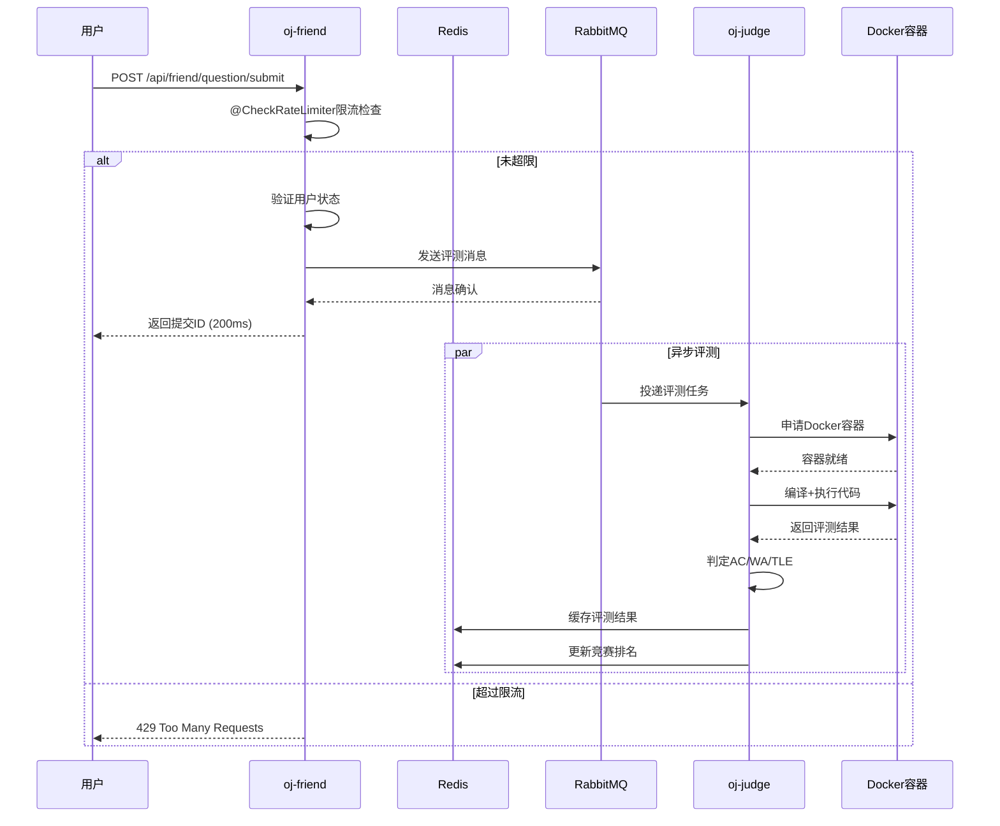

#### 3.3.5 Redis多级缓存架构

**缓存键设计规范** (`oj-common/oj-common-core/src/main/java/com/example/common/core/constants/CacheConstants.java`):

```java
public class CacheConstants {
    // 用户令牌: login:token:{userId}
    public static final String USER_TOKEN_PREFIX = "login:token:";

    // 提交记录: submit:{userId}:{questionId}
    public static final String SUBMIT_KEY_PREFIX = "submit:";

    // 题目列表: question:list
    public static final String QUESTION_LIST_KEY = "question:list";

    // 竞赛排名: exam:rank:list:{examId}
    public static final String EXAM_RANK_LIST_KEY_PREFIX = "exam:rank:list:";

    // 热榜: hot:question:list
    public static final String HOT_QUESTION_LIST_KEY = "hot:question:list";

    // 限流器: submit:limiter:{userId}
    public static final String SUBMIT_LIMITER_KEY_PREFIX = "submit:limiter:";
}
```

**缓存策略矩阵**:

| 缓存类型 | Key Pattern | TTL | 数据结构 | 业务场景 |
|---------|------------|-----|---------|---------|
| 用户令牌 | `login:token:{userId}` | 12h | String | 用户认证 |
| 提交记录 | `submit:{uid}:{qid}` | 1h | String | 结果查询 |
| 题目列表 | `question:list` | 5min | List | 题目浏览 |
| 竞赛排名 | `exam:rank:list:{eid}` | 实时 | List | 实时排名 |
| 热榜 | `hot:question:list` | 永久 | ZSet | 热门推荐 |
| 限流器 | `submit:limiter:{uid}` | 30min | RateLimiter | 防刷保护 |

#### 3.3.6 缓存预热与刷新机制

```java
// QuestionCacheManager.java:29-43
@Component
public class QuestionCacheManager {

    @Autowired
    private RedisService redisService;

    @Autowired
    private QuestionMapper questionMapper;

    /**
     * 缓存预热：从数据库全量加载题目列表
     * 由XXL-Job定时触发，每5分钟执行一次
     */
    public void refreshQuestionCache() {
        List<Question> questions = questionMapper.selectList(
            new LambdaQueryWrapper<Question>()
                .select(Question::getQuestionId)
                .orderByDesc(Question::getCreateTime)
        );

        if (CollectionUtils.isEmpty(questions)) {
            return;
        }

        List<Long> questionIds = questions.stream()
            .map(Question::getQuestionId)
            .toList();

        // 删除旧缓存
        redisService.deleteObject(CacheConstants.QUESTION_LIST_KEY);
        // 刷新缓存
        redisService.rightPushAll(CacheConstants.QUESTION_LIST_KEY, questionIds);
    }
}
```

#### 3.3.7 竞赛实时排名系统

```java
// ExamRankCacheManager.java:24-51
@Component
public class ExamRankCacheManager {

    @Autowired
    private RedisService redisService;

    @Autowired
    private UserExamMapper userExamMapper;

    /**
     * 刷新竞赛排名缓存
     * 竞赛结束后由定时任务触发
     */
    public void refreshCache(Long examId) {
        // 从数据库获取排名数据
        List<ExamRankVO> examRankList = userExamMapper.getExamRankList(examId);
        if (CollectionUtils.isEmpty(examRankList)) {
            return;
        }

        String key = getExamRankListKey(examId);

        // 原子性更新：先删后写
        redisService.deleteObject(key);
        redisService.rightPushAll(key, examRankList);
    }

    /**
     * 分页获取排名（O(1)时间复杂度）
     */
    public List<ExamRankVO> getVOList(ExamRankDTO examRankDTO) {
        int start = (examRankDTO.getPageNum() - 1) * examRankDTO.getPageSize();
        int end = start + examRankDTO.getPageSize() - 1;

        return redisService.getCacheListByRange(
            getExamRankListKey(examRankDTO.getExamId()),
            start,
            end,
            ExamRankVO.class
        );
    }
}
```

---

### 3.4 消息队列解耦设计 (oj-judge)

**核心代码**: `oj-modules/oj-judge/src/main/java/com/example/judge/rabbit/JudgeConsumer.java`

```java
@Slf4j
@Component
public class JudgeConsumer {

    @Autowired
    private JudgeService judgeService;

    /**
     * 异步消费评测消息
     * 工作队列模式，支持多消费者并行处理
     */
    @RabbitListener(queues = RabbitMQConstants.OJ_WORK_QUEUE)
    public void consume(JudgeDTO judgeDTO) {
        log.info("收到RabbitMQ评测消息: userId={}, questionId={}",
                 judgeDTO.getUserId(), judgeDTO.getQuestionId());

        judgeService.doJudgeJavaCode(judgeDTO);
    }
}
```

#### 3.4.1 消息可靠性保障

| 保障机制 | 实现方式 | 业务价值 |
|---------|---------|---------|
| **消息持久化** | 交换机+队列+消息持久化 | 服务重启消息不丢失 |
| **手动ACK** | @RabbitListener + Channel.basicAck | 消费失败不确认，重新投递 |
| **死信队列** | DLX配置 + 过期转发 | 失败消息集中处理 |
| **生产者确认** | PublisherConfirm机制 | 发送失败及时告警 |

#### 3.4.2 消息流程图

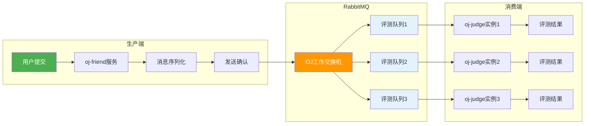

---

## 四、高并发场景下的解决方案

### 4.1 秒杀场景：提交限流与容器调度

**业务场景**: 竞赛开始瞬间，大量用户同时提交代码

**技术方案**:

```java
// 1. 网关层限流：超出阈值直接拒绝
@CheckRateLimiter(limit = 10, interval = 60)
public Result submitCode(...) { ... }

// 2. 消息队列削峰：异步处理评测
judgeProducer.sendJudgeMessage(judgeDTO);

// 3. 容器池复用：避免频繁创建销毁
containerId = dockerSandBoxPool.getContainer();
try {
    // 执行评测
} finally {
    dockerSandBoxPool.returnContainer(containerId);
}
```

**性能瓶颈分析**:

| 瓶颈点 | 触发条件 | 影响 | 优化方案 |
|-------|---------|-----|---------|
| 容器池耗尽 | 并发 > poolSize(5) | 线程阻塞等待 | 动态扩容容器池 |
| Redis连接耗尽 | QPS > 1000 | 服务不可用 | Redis Cluster |
| 消息积压 | 评测耗时 > 消费速度 | 延迟增加 | 增加消费者实例 |
| 内存溢出 | 单容器内存超限 | OOM崩溃 | 容器资源硬限制 |

### 4.2 竞赛排名：Redis List实时排行

**业务场景**: 竞赛过程中，用户提交后实时更新排名

**技术方案**:

```java
// 每次提交后刷新排名缓存
public void refreshCache(Long examId) {
    List<ExamRankVO> examRankList = userExamMapper.getExamRankList(examId);
    String key = CacheConstants.EXAM_RANK_LIST_KEY_PREFIX + examId;

    redisService.deleteObject(key);
    redisService.rightPushAll(key, examRankList);
}

// 分页查询排名（O(1)时间复杂度）
public List<ExamRankVO> getRankList(ExamRankDTO dto) {
    int start = (dto.getPageNum() - 1) * dto.getPageSize();
    int end = start + dto.getPageSize() - 1;

    return redisService.getCacheListByRange(
        CacheConstants.EXAM_RANK_LIST_KEY_PREFIX + dto.getExamId(),
        start, end, ExamRankVO.class
    );
}
```

**性能优势**:
- **查询O(1)**: 直接通过索引范围获取，无需排序
- **实时更新**: 每次提交后刷新缓存
- **内存友好**: 只存储排名数据，不存储全量提交

### 4.3 热榜推荐：Redis ZSet智能排序

**业务场景**: 基于用户行为（提交次数）生成热门题目排行

**技术方案**:

```java
// 首次提交时更新热榜（防刷榜）
if (result == 0) { // result == 0 表示首次提交
    redisService.zSetIncrementScoreByOne(
        CacheConstants.HOT_QUESTION_LIST_KEY,
        judgeDTO.getQuestionId()
    );
}

// 获取热榜Top10
public List<Question> getHotQuestions() {
    Set<ZSetOperations.TypedTuple<Long>> hotQuestions =
        redisService.reverseRangeWithScores(
            CacheConstants.HOT_QUESTION_LIST_KEY,
            0, 9
        );

    return hotQuestions.stream()
        .map(tuple -> questionService.getById(tuple.getValue()))
        .collect(Collectors.toList());
}
```

**防刷榜机制**:
- 只统计首次提交（`result == 0`）
- 同一用户同一题目多次提交不增加热度
- 配合限流器防止恶意刷提交

---

## 五、技术短板分析与优化点

### 5.1 当前技术瓶颈

| 痛点 | 根因分析 | 影响范围 | 风险等级 |
|-----|---------|---------|---------|
| **单机Docker容器池** | 5个容器固定限制 | 高并发时响应延迟飙升 | 高 |
| **Redis单点** | 无Cluster部署 | 故障时全站不可用 | 高 |
| **同步评测** | 多个测试用例串行执行 | 单次评测耗时成倍增加 | 中 |
| **无熔断降级** | 评测服务故障蔓延 | 雪崩风险 | 中 |
| **数据库连接池** | 默认配置偏保守 | 高并发时连接等待 | 低 |

### 5.2 优化路线图

#### 短期优化（1-2周）

| 优化项 | 实现方案 | 预期收益 |
|-------|---------|---------|
| **并行测试用例** | CompletableFuture并行执行 | 评测耗时降低50% |
| **本地缓存** | 引入Caffeine | Redis QPS降低60% |
| **熔断器** | 集成Sentinel/Resilience4j | 故障隔离，防止雪崩 |
| **连接池优化** | HikariCP maxLifetime调整 | 连接复用率提升 |

#### 中期优化（1个月）

| 优化项 | 实现方案 | 预期收益 |
|-------|---------|---------|
| **容器池水平扩展** | K8s HPA自动伸缩 | 支持500+ QPS |
| **Redis Cluster** | 数据分片 + 读写分离 | 可用性99.99% |
| **结果异步推送** | WebSocket实时通知 | 用户体验提升 |
| **消息批量消费** | prefetchCount=10 | 吞吐量提升30% |

#### 长期规划（3个月+）

| 优化项 | 实现方案 | 预期收益 |
|-------|---------|---------|
| **多语言评测** | Python/C++/Go容器镜像 | 业务覆盖提升200% |
| **分布式追踪** | SkyWalking全链路监控 | 问题定位<1min |
| **Serverless评测** | 函数计算按需调用 | 成本降低50% |
| **边缘计算** | 多地域部署评测节点 | 延迟降低30% |

### 5.3 Trade-offs分析

| 决策点 | 当前方案 | 备选方案 | 为什么选当前 |
|-------|---------|---------|-------------|
| 容器管理 | 预创建+复用 | 每次创建销毁 | 减少容器启动时间(2-5s) |
| 评测模式 | 同步执行 | 异步评测 | 结果需要立即返回 |
| 缓存更新 | 延迟双删 | Canal CDC | 实现简单，成本低 |
| 限流算法 | 令牌桶 | 滑动窗口 | 支持突发流量 |
| 排名存储 | Redis List | MySQL | 查询O(1)，实时性好 |

---

## 六、项目Q&A

### Q1：如何保证缓存与数据库的一致性？

**A**：本项目采用"延迟双删 + 消息队列异步刷新"方案：

```java
// 1. 写操作：延迟双删
public void updateQuestion(Question question) {
    // 第一删：更新前删缓存
    redisService.deleteObject(CacheConstants.QUESTION_LIST_KEY);

    // 2. 更新数据库
    questionMapper.updateById(question);

    // 3. 延迟第二删：应对主从延迟
    rabbitMQ.sendDelayMessage("refresh:question:cache", 500);
}

// 4. 消息消费者刷新缓存
@RabbitListener(queues = "refresh:question:cache")
public void onRefreshCache() {
    refreshQuestionCache();
}
```

**Trade-offs分析**：
- 优点：实现简单，能应对99%的场景
- 缺点：无法保证强一致性，极端情况有短暂不一致
- 替代方案：Canal订阅binlog实现CDC同步

---

### Q2：Docker沙箱如何保证安全性？

**A**：从4个层面构建纵深防御：

```java
// DockerSandBoxPool.java:120-132
private HostConfig getHostConfig(String containerName) {
    HostConfig hostConfig = new HostConfig();

    // 1. 内存限制：防止OOM攻击
    hostConfig.withMemory(256 * 1024 * 1024L);    // 256MB
    hostConfig.withMemorySwap(0L);                // 禁止Swap

    // 2. CPU限制：防止计算资源滥用
    hostConfig.withCpuCount(1L);                  // 1核

    // 3. 网络隔离：完全阻断外网访问
    hostConfig.withNetworkMode("none");

    // 4. 只读根文件系统：防止容器逃逸
    hostConfig.withReadonlyRootfs(true);

    return hostConfig;
}
```

**攻击面防护矩阵**：

| 攻击类型 | 防护措施 | 代码位置 |
|---------|---------|---------|
| 资源耗尽 | 内存/CPU/时间硬限制 | DockerSandBoxPool:120-132 |
| 逃逸攻击 | 非特权容器 + 只读根文件系统 | withReadonlyRootfs(true) |
| 信息泄露 | 网络隔离 + 无敏感文件挂载 | withNetworkMode("none") |
| 恶意代码 | 沙箱内禁止文件写入 | Bind挂载为只读 |

---

### Q3：消息队列积压了怎么办？

**A**：需要分场景处理：

**1. 消费端优化**：
```java
// 增加消费者实例（oj-judge可水平扩展）
// 配置批量消费
@RabbitListener(queues = RabbitMQConstants.OJ_WORK_QUEUE,
                properties = {"prefetch=10"})
public void consume(JudgeDTO judgeDTO) { ... }
```

**2. 生产端限流**：
```java
// 网关层限流：超过阈值返回"系统繁忙"
@CheckRateLimiter(limit = 50, interval = 60)
public Result submitCode(...) { ... }
```

**3. 死信处理**：
```java
// 配置死信队列
@Bean
public DirectExchange deadLetterExchange() {
    return new DirectExchange("dlx.exchange");
}

@Bean
public Queue deadLetterQueue() {
    return QueueBuilder.durable("dlx.queue")
        .deadLetterExchange("dlx.exchange")
        .deadLetterRoutingKey("dlx.key")
        .build();
}
```

**4. 监控告警**：
- RabbitMQ Management API监控队列深度
- 队列深度 > 10000 触发告警
- 自动扩容消费者实例

---

### Q4：如何设计一个高可用的分布式限流器？

**A**：本项目使用Redisson RRateLimiter：

```java
// RedisLimiterManager.java:28-43
public void doRateLimit(String key, int limit, int interval, RateType rateType) {
    RRateLimiter rateLimiter = redissonClient.getRateLimiter(
        CacheConstants.SUBMIT_LIMITER_KEY_PREFIX + key
    );

    // 原子化配置（避免重复初始化）
    if (!rateLimiter.isExists()) {
        rateLimiter.trySetRate(rateType, limit, interval, RateIntervalUnit.SECONDS);
        rateLimiter.expire(30L, TimeUnit.MINUTES);
    }

    if (!rateLimiter.tryAcquire(1)) {
        throw new ServiceException(ResultCode.FAILED_SUBMIT_FREQUENT);
    } else {
        // 使用后动态续签TTL
        rateLimiter.expire(30L, TimeUnit.MINUTES);
    }
}
```

**高可用保障**：
1. **Redis Cluster**：多节点部署，单点故障自动切换
2. **本地缓存**：Guava Cache缓存限流结果，减少Redis访问
3. **降级策略**：Redis故障时自动切换为单机限流（降级放行）

**算法对比**：

| 算法 | 特点 | 适用场景 |
|-----|------|---------|
| 令牌桶 | 平滑，支持突发流量 | API限流（本项目选用） |
| 滑动窗口 | 精度高 | 精确限流 |
| 计数器 | 简单实现 | 粗粒度限制 |

---

### Q5：容器池耗尽时如何处理？

**A**：本项目采用**阻塞等待 + 超时降级**策略：

```java
// DockerSandBoxPool.java:56-62
public String getContainer() {
    try {
        // 阻塞等待直到有容器可用
        return containerQueue.take();
    } catch (InterruptedException e) {
        throw new RuntimeException(e);
    }
}
```

**优化方向**：

| 方案 | 实现方式 | 优缺点 |
|-----|---------|-------|
| 动态扩容 | K8s HPA自动创建新容器 | 成本增加，但弹性好 |
| 超时机制 | await(timeout, unit) | 快速失败，用户体验差 |
| 优先级队列 | VIP用户优先获取 | 实现复杂，公平性差 |
| 降级处理 | 返回友好提示+稍后重试 | 用户体验好，需要前端配合 |

---

## 七、数据库设计

### 7.1 ER关系图

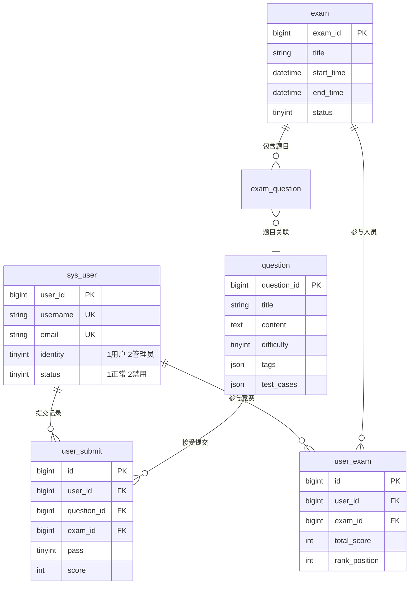

### 7.2 核心表结构

#### 用户表 (sys_user)
```sql
CREATE TABLE sys_user (
    user_id BIGINT PRIMARY KEY AUTO_INCREMENT,
    username VARCHAR(50) UNIQUE NOT NULL,
    password VARCHAR(255) NOT NULL,
    email VARCHAR(100) UNIQUE,
    nickname VARCHAR(50),
    avatar VARCHAR(255),
    identity TINYINT DEFAULT 1 COMMENT '1用户 2管理员',
    status TINYINT DEFAULT 1 COMMENT '1正常 2禁用',
    create_time DATETIME DEFAULT CURRENT_TIMESTAMP,
    update_time DATETIME DEFAULT CURRENT_TIMESTAMP ON UPDATE CURRENT_TIMESTAMP
);
```

#### 题目表 (question)
```sql
CREATE TABLE question (
    question_id BIGINT PRIMARY KEY AUTO_INCREMENT,
    title VARCHAR(200) NOT NULL,
    content TEXT,
    difficulty TINYINT DEFAULT 1,
    score INT DEFAULT 100,
    tags JSON,
    test_cases JSON,
    sample_input TEXT,
    sample_output TEXT,
    time_limit INT DEFAULT 1000 COMMENT 'ms',
    space_limit INT DEFAULT 128 COMMENT 'MB',
    status TINYINT DEFAULT 1,
    create_time DATETIME DEFAULT CURRENT_TIMESTAMP
);
```

#### 竞赛表 (exam)
```sql
CREATE TABLE exam (
    exam_id BIGINT PRIMARY KEY AUTO_INCREMENT,
    title VARCHAR(200) NOT NULL,
    description TEXT,
    start_time DATETIME,
    end_time DATETIME,
    duration INT COMMENT '分钟',
    status TINYINT DEFAULT 1 COMMENT '1未发布 2已发布 3已结束',
    create_time DATETIME DEFAULT CURRENT_TIMESTAMP
);
```

#### 用户提交表 (user_submit)
```sql
CREATE TABLE user_submit (
    id BIGINT PRIMARY KEY AUTO_INCREMENT,
    user_id BIGINT NOT NULL,
    question_id BIGINT NOT NULL,
    exam_id BIGINT,
    user_code TEXT,
    program_type VARCHAR(20) DEFAULT 'java',
    pass TINYINT DEFAULT 0 COMMENT '0未通过 1通过',
    score INT DEFAULT 0,
    exe_message TEXT,
    case_judge_res JSON,
    submit_time DATETIME DEFAULT CURRENT_TIMESTAMP,
    INDEX idx_user_question (user_id, question_id),
    INDEX idx_exam (exam_id)
);
```

---

## 八、部署架构

### 8.1 容器化部署

```yaml
# docker-compose.yml
version: '3.8'
services:
  oj-gateway:
    image: oj-gateway:latest
    ports:
      - "8080:8080"
    environment:
      - SPRING_PROFILES_ACTIVE=prod
      - NACOS_SERVER=nacos:8848
    depends_on:
      - nacos

  oj-friend:
    image: oj-friend:latest
    environment:
      - SPRING_PROFILES_ACTIVE=prod
      - REDIS_HOST=redis
      - RABBITMQ_HOST=rabbitmq
    depends_on:
      - redis
      - rabbitmq

  oj-judge:
    image: oj-judge:latest
    volumes:
      - /var/run/docker.sock:/var/run/docker.sock
    environment:
      - SPRING_PROFILES_ACTIVE=prod
      - SANDBOX_DOCKER_HOST=unix:///var/run/docker.sock
    depends_on:
      - redis
      - rabbitmq

  mysql:
    image: mysql:8.0
    environment:
      - MYSQL_ROOT_PASSWORD=root123
      - MYSQL_DATABASE=coding_arena

  redis:
    image: redis:7.0-alpine

  rabbitmq:
    image: rabbitmq:3.11-management

  nacos:
    image: nacos/nacos-server:v2.2.0
```

### 8.2 环境配置

| 环境 | 配置特点 | 适用场景 |
|-----|---------|---------|
| 开发环境 | 本地Docker Compose一键启动 | 开发调试 |
| 测试环境 | 独立数据库和中间件 | 功能测试 |
| 生产环境 | K8s集群部署 | 线上服务 |

---

## 九、项目亮点总结

### 9.1 架构亮点

| 亮点 | 技术实现 | 业务价值 |
|-----|---------|---------|
| **微服务拆分** | 4个独立服务 | 独立部署，独立扩展 |
| **容器化执行** | Docker沙箱隔离 | 安全可控的代码执行 |
| **异步解耦** | RabbitMQ消息队列 | 高并发场景下的流量削峰 |
| **弹性扩展** | 无状态服务设计 | 支持水平扩展 |

### 9.2 技术亮点

| 亮点 | 技术实现 | 代码位置 |
|-----|---------|---------|
| **Docker容器池** | ArrayBlockingQueue预创建容器 | DockerSandBoxPool.java |
| **JWT无状态认证** | 网关统一验证 + Redis令牌校验 | AuthFilter.java |
| **Redis多级缓存** | String + List + ZSet混合使用 | CacheConstants.java |
| **分布式限流** | Redisson RRateLimiter | RedisLimiterManager.java |

### 9.3 业务亮点

| 亮点 | 技术实现 | 用户价值 |
|-----|---------|---------|
| **实时排名** | Redis List缓存分页 | 竞赛体验流畅 |
| **热榜推荐** | Redis ZSet智能排序 | 发现优质题目 |
| **快速反馈** | 异步评测 + 结果缓存 | 提交即返回 |

---

## 十、核心代码引用索引

| 模块 | 核心类 | 行号 | 职责 |
|-----|-------|-----|------|
| 网关 | `AuthFilter.java` | 43-169 | JWT认证+权限校验 |
| 评测 | `DockerSandBoxPool.java` | 17-170 | 容器池管理 |
| 评测 | `SandboxPoolServiceImpl.java` | 31-173 | 代码编译执行 |
| 评测 | `JudgeServiceImpl.java` | 30-178 | 结果判定+热榜更新 |
| 限流 | `RedisLimiterManager.java` | 16-48 | 分布式限流 |
| 缓存 | `QuestionCacheManager.java` | 17-66 | 题目缓存管理 |
| 排名 | `ExamRankCacheManager.java` | 15-51 | 竞赛排名缓存 |
| 消息 | `JudgeConsumer.java` | 13-23 | RabbitMQ消费 |
| 常量 | `CacheConstants.java` | 1-38 | 缓存键定义 |
| 状态 | `CodeRunStatus.java` | 1-20 | 评测结果枚举 |

---

## 十一、未来规划

### 11.1 功能增强
- [ ] 多语言评测：Python/C++/Go支持
- [ ] AI辅助：智能代码提示、错误诊断
- [ ] 社交功能：题解分享、讨论社区
- [ ] 移动端：微信小程序/APP支持

### 11.2 性能优化
- [ ] 全球加速：CDN全球节点部署
- [ ] 边缘计算：代码评测边缘节点
- [ ] 智能调度：基于负载的评测调度
- [ ] 缓存优化：多级缓存架构优化

### 11.3 架构升级
- [ ] Service Mesh：Istio服务网格
- [ ] Serverless：函数计算评测引擎
- [ ] 云原生：Kubernetes原生部署
- [ ] 多云支持：阿里云/腾讯云/华为云适配

---

*文档生成时间：2026-01-14*
*技术栈版本：Spring Boot 3.0.1 / Spring Cloud 2022.0.0 / Java 17 / Docker*
*项目地址：https://github.com/1067367579/coding-arena*
